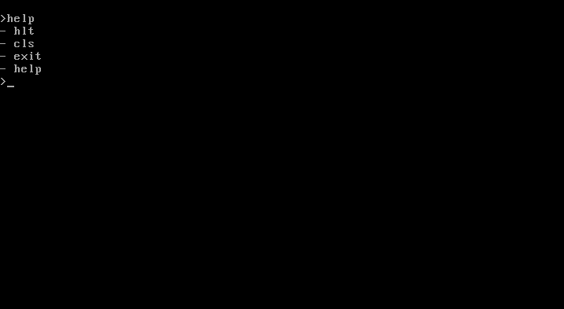
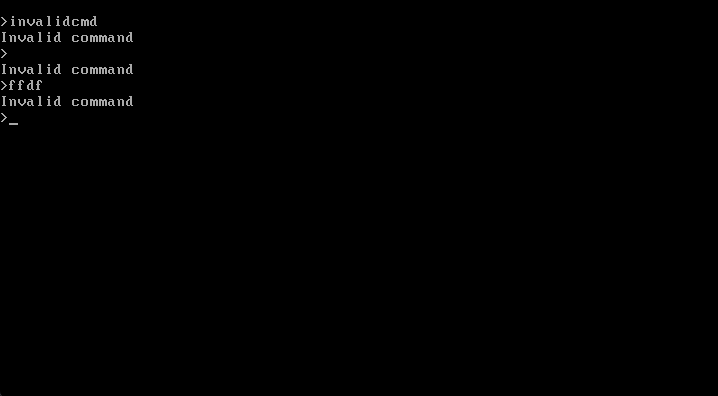
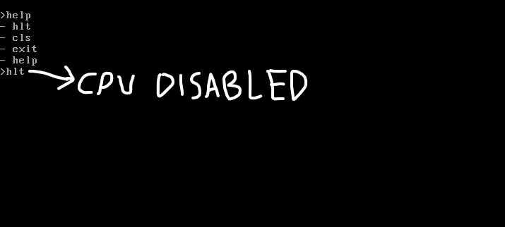

# os-shell
A basic shell OS made in assembly. Can be booted as an OS.

Note: Some things may not work on VMWare, VirtualBox or any real machines. This is because it can't read pointers from the bootloader.

## What I used
- Make (downloaded from chocolatey)
- Notepad++
- NASM (Assembler)
- QEMU (Emulator)

## How to install
To install it, downlaod NASM from here:
- https://www.nasm.us/

To test it, download QEMU from here:
- https://www.qemu.org/download/

To make things easier, install the make command from chocolatey
- https://chocolatey.org/install

Then run cmd as admin and do: `choco install make`

## Commands
- help (sends the help message)
- cls (clears the screen)
- exit (shuts down the OS. this won't work on VMWare or anything. If it doesn't work, it halts the CPU.)
- hlt (Halts the CPU (disabling it) and forcing you to make a system restart)

### If you type an invalid keyword it will say "Invalid command".

  </img>
  </img>
  </img>
  

